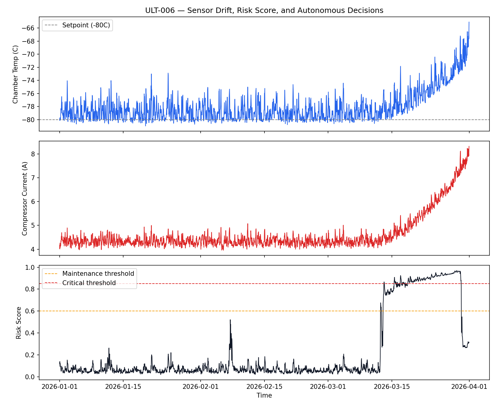
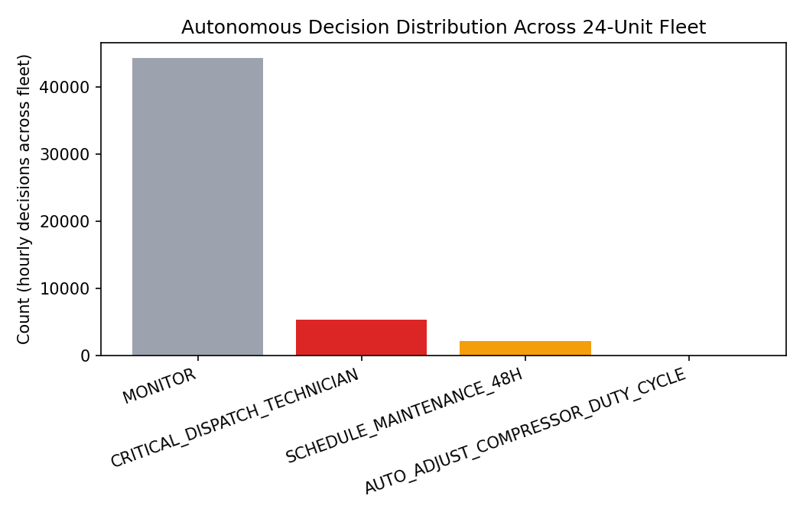

# Autonomous AI for Predictive Maintenance — ULT Freezer Fleet

A working implementation of a **perceive → reason → act** autonomous AI system, applied to predictive maintenance for Ultra-Low Temperature (ULT) freezers — the equipment used in cold-chain storage for vaccines, biologics, and lab samples.

Most predictive maintenance systems stop at "predict": they output a risk score on a dashboard and leave the decision to a human. This project closes the loop — it perceives sensor state, reasons about risk using a blended ML approach, and **acts** by issuing a concrete, logged decision (monitor / schedule maintenance / dispatch technician / auto-adjust setpoint).

## Why this exists

Most predictive maintenance systems stop at a risk score on a dashboard. The interesting engineering problem is what happens *after* that number — deciding what to actually do about it, and doing it early enough to matter. That's what this closes the loop on.

## Architecture

```
┌─────────────┐     ┌──────────────┐     ┌─────────────┐     ┌───────────────┐
│   PERCEIVE  │ --> │    REASON    │ --> │     ACT     │ --> │ SELF-IMPROVE  │
│             │     │              │     │             │     │  (stub/roadmap)│
│ Rolling     │     │ IsolationFor.│     │ Rule-based  │     │ Retrain on    │
│ window      │     │ (unsupervised│     │ decision    │     │ new confirmed │
│ features:   │     │  anomaly)    │     │ policy:     │     │ failures,     │
│ drift, trend│     │      +       │     │ MONITOR /   │     │ closes the    │
│ volatility  │     │ GradientBoost│     │ SCHEDULE /  │     │ loop over time│
│ per sensor  │     │ (supervised  │     │ CRITICAL /  │     │               │
│             │     │  risk score) │     │ AUTO_ADJUST │     │               │
└─────────────┘     └──────────────┘     └─────────────┘     └───────────────┘
```

This mirrors the framework from a whitepaper I wrote on autonomous AI systems for industrial automation — this repo is the proof-of-concept that the architecture actually holds up on real (synthetic) data end to end.

## What's in here

| File | Stage | What it does |
|---|---|---|
| `data/generate_sensor_data.py` | — | Simulates a 24-unit ULT freezer fleet with realistic run-to-failure degradation trajectories (compressor wear → rising current, rising vibration, temperature drift) |
| `src/perceive.py` | Perceive | Builds rolling-window features (6h/24h trend, volatility, drift) from raw telemetry |
| `src/reason.py` | Reason | Trains an IsolationForest + GradientBoostingClassifier blend, producing a 0–1 risk score |
| `src/act.py` | Act | Rule-based decision policy that converts risk score + drift signals into a concrete action |
| `src/pipeline.py` | Orchestration | Runs the full loop hour-by-hour across the fleet, logs every decision |
| `api/main.py` | Serving | FastAPI endpoint for real-time inference on a live sensor window |
| `make_plots.py` | — | Generates the result visualizations below |

## Results

Trained and evaluated with a **group-level split** (entire units held out, not just rows — row-level splits leak adjacent time steps from the same degradation trajectory and produce misleadingly perfect scores).

- **ROC-AUC: 0.945** on fully unseen units
- **Early warning lead time: 300–2,000+ hours** before failure onset across the 14 units in the fleet that follow a degradation trajectory — this is the number that actually matters for maintenance planning, not just detection accuracy





Note: this uses synthetic sensor data with an engineered degradation signal, so these numbers demonstrate that the *architecture* works end to end — they aren't a claim about performance on real fleet data, which would need real telemetry and domain validation.

## Running it

```bash
pip install -r requirements.txt

# 1. Generate synthetic fleet telemetry
python3 data/generate_sensor_data.py

# 2. Engineer perceive-stage features
python3 src/perceive.py

# 3. Train the reason-stage models
python3 src/reason.py

# 4. Run the full closed-loop pipeline
python3 -m src.pipeline

# 5. Generate result plots
python3 make_plots.py

# 6. Serve real-time predictions
uvicorn api.main:app --reload --port 8000
curl -X POST http://localhost:8000/predict -H "Content-Type: application/json" -d @sample_request.json
```

## Design notes

- **Two models, not one.** IsolationForest catches anomalies with zero failure history (important for new units on day one); GradientBoostingClassifier learns the specific pre-failure signature once labeled history exists. Blending both is more robust than relying on either alone.
- **Trained on the pre-failure window, not the failure itself.** The label used for training (`at_risk`) covers the degradation period *before* failure, not the failure event itself — training on "failed" only teaches a model to recognize a failure that already happened, which defeats the point of predictive maintenance.
- **Decisions are logged and explainable.** Every action comes with a `reason` string referencing the actual risk score and drift values that triggered it — no black-box alerts.

## What I'd add next

- Real telemetry integration (this fleet is synthetic — the next step is validating against actual sensor logs)
- Self-improve loop: automatic retraining trigger when confirmed failures come in
- Multi-unit fleet-level prioritization when several units flag simultaneously
